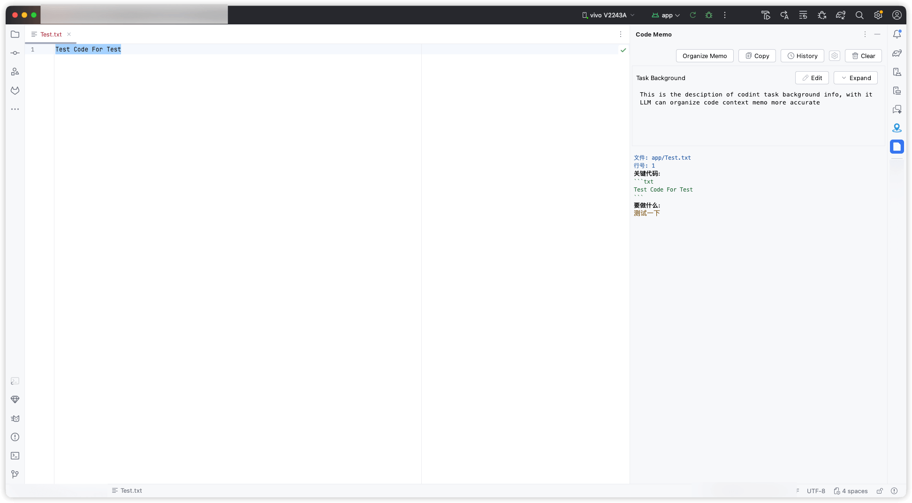
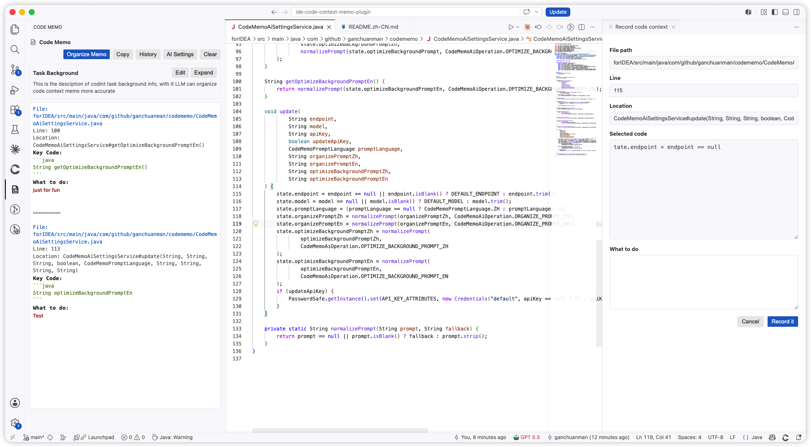

# IDE Code Context Memo Plugin

English | [中文](README.zh-CN.md)

IDE Code Context Memo helps you collect selected code snippets, file locations, and task notes into a project-level memo that can be copied directly to a coding agent.

The repository contains two implementations:

- `forIDEA`: JetBrains IDE plugin for IntelliJ IDEA and Android Studio.
- `forVSCode`: VS Code extension.

## Preview

### JetBrains IDE



### VS Code



## Features

- Adds a `Code Memo` side panel.
- Adds `Record code context` to the editor context menu when code is selected.
- Records project-relative file path, line range, best-effort code location, selected code, and a `What to do` note.
- Appends each record to the memo so users can freely edit the final text.
- Copies only the memo body.
- Persists task background, memo text, and history per project or workspace.
- Keeps at most 20 history snapshots and supports deleting a single snapshot.
- Supports DeepSeek/OpenAI-compatible chat completion APIs.
- Provides two editable AI prompt sets: Chinese and English.
- Uses the selected prompt language to generate memo field labels:
  - Chinese: `文件`, `行号`, `位置`, `关键代码`, `要做什么`
  - English: `File`, `Line`, `Location`, `Key Code`, `What to do`
- Keeps the product UI in English.
- Uses a blank line between memo records instead of decorative separators.

## AI Settings

AI settings include:

- Endpoint
- Model
- API Key
- Prompt Language
- Organize Memo Prompt
- Optimize Task Background Prompt

The default endpoint is DeepSeek-compatible:

```text
https://api.deepseek.com/chat/completions
```

The default model is:

```text
deepseek-v4-pro
```

## Install

Marketplace publishing materials and submit checklist are maintained in [PUBLISHING.md](PUBLISHING.md).

JetBrains IDE package:

```text
dist/code-context-memo-0.7.5.zip
```

VS Code package:

```text
dist/code-context-memo-vscode-0.7.5.vsix
```

For JetBrains IDEs, install the zip from disk and restart the IDE after plugin updates so the IDE can reload plugin classes and actions.

## Build

JetBrains plugin requirements:

- JDK 17 or newer
- Gradle 9.0 or newer

Build:

```bash
cd forIDEA
gradle buildPlugin
```

VS Code extension requirements:

- Node.js
- VS Code CLI if you want to test local installation

Check and prepare package files:

```bash
cd forVSCode
npm run check
npm run prepare-vsix
```

Local build outputs are created under `forIDEA/build/distributions/` and `forVSCode/build/distributions/`. The latest installable artifacts tracked in this repository are copied into `dist/`.

## Storage

- JetBrains memo data is stored at project level through the IDE workspace file.
- VS Code memo data is stored at workspace level.
- AI settings are shared at application/global level.
- API keys are stored through the IDE or VS Code secret storage mechanism instead of plain memo text.

## Privacy

The plugins do not include telemetry. AI features are optional and only send memo/task background content to the OpenAI-compatible endpoint configured by the user. See [PRIVACY.md](PRIVACY.md).

## License

MIT License. See [LICENSE](LICENSE).
